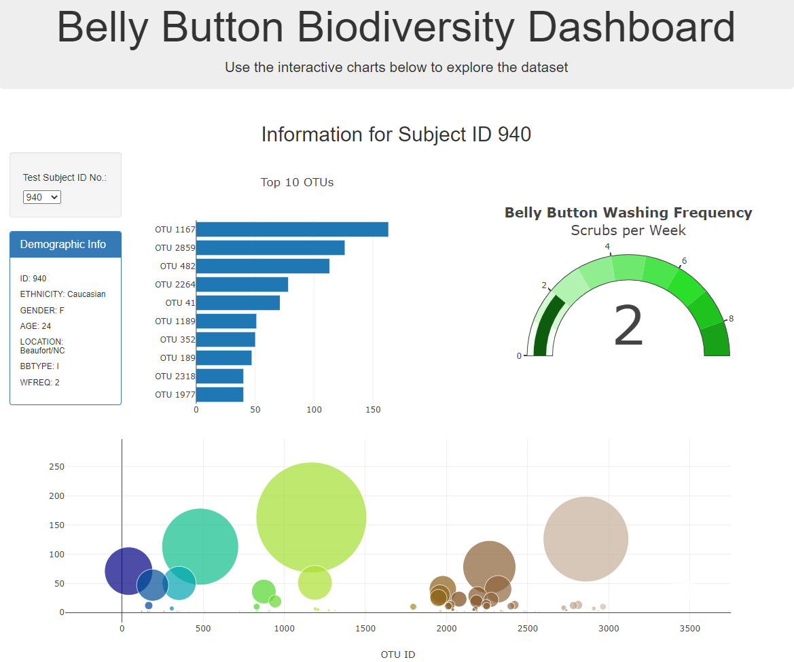

# The Belly Button Biodiversity :: Interactive Web Visualisation

The main objective of this project is to build an **interactive** dashboard to **visualise** and **explore** the [Belly Button Biodiversity dataset](http://robdunnlab.com/projects/belly-button-biodiversity/), which catalogs the microbes that colonize human navels.

The dataset reveals that a small handful of microbial species (also called operational taxonomic units, or OTUs, in the study) were present in more than 70% of people, while the rest were relatively rare.

The project is organised in two main components:

* **`index.html`**: Dashboard page, designed to receive the information and graphs that are prepared by the JavaScript file below;
* **`app.js`**: JavaScript responsible to fetch the dataset from the JSON file available in the provided URL `https://2u-data-curriculum-team.s3.amazonaws.com/dataviz-classroom/v1.1/14-Interactive-Web-Visualizations/02-Homework/samples.json`.

## Resources

* [Belly Button Biodiversity site](http://robdunnlab.com/projects/belly-button-biodiversity/)
* [Belly Button - Samples Dataset](https://2u-data-curriculum-team.s3.amazonaws.com/dataviz-classroom/v1.1/14-Interactive-Web-Visualizations/02-Homework/samples.json)
* [Gauge Chart](https://plot.ly/javascript/gauge-charts/)

## Implementation Steps

The following steps were followed to implement this project:

1. D3 library used to read in  `samples.json`  from the URL  `https://2u-data-curriculum-team.s3.amazonaws.com/dataviz-classroom/v1.1/14-Interactive-Web-Visualizations/02-Homework/samples.json`.
2. Dropdown menu to display the list of idividuals present in the database. In case the selected option is changed, all the components should be refreshed with the correspondent data.
3. Summary table that brings and displays the sample metadata, i.e., an individual's demographic information.
4. Horizontal Bar Chart Create a horizontal bar chart to display the top 10 OTUs found in that individual:
	* `sample_values` used as the values for the bar chart.
	* `otu_ids` used as the labels for the bar chart.
	* `otu_labels` used as the hovertext for the chart.
5. Bubble Chart that displays each sample, considering:
	* Use  `otu_ids`  for the x values.
	* Use  `sample_values`  for the y values.
	* Use  `sample_values`  for the marker size.
	* Use  `otu_ids`  for the marker colors.
	* Use  `otu_labels`  for the text values.
6. Gauge Chart to plot the weekly washing frequency of the individual.
	* Consider to account for values ranging from 0 to 9.
	* Washing Frequency information extracted from the Metadata information `wfreq`.

## Dashboard

The Dashboard was build and the image below brings a snapshot of the iteractive visualisation page.

## References

Hulcr, J. et al. (2012)  _A Jungle in There: Bacteria in Belly Buttons are Highly Diverse, but Predictable_. Retrieved from:  [http://robdunnlab.com/projects/belly-button-biodiversity/results-and-data/](http://robdunnlab.com/projects/belly-button-biodiversity/results-and-data/)